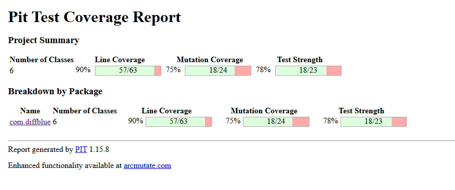

Test URL
http://localhost:8080/?emailId=sid@gmail.com
http://localhost:8080/?emailId=s@gmail.com
http://localhost:8080/?emailId=
http://localhost:8080/?emailId=@gmail.com
http://localhost:8080/api/emp?id=0

Diffblue Cover supports the following Java versions: Java 8 (8u391 and 8u381), Java 11 (11.0.21 and 11.0.20), Java 17 (17.0.9 and 17.0.8), and Java 21 (21.0.1).
Diffblue only supports LTS versions 8, 11, and 17 in production use. However, Diffblue Cover can write tests and provide community support for non-LTS Java versions (9, 10, 12-16)
